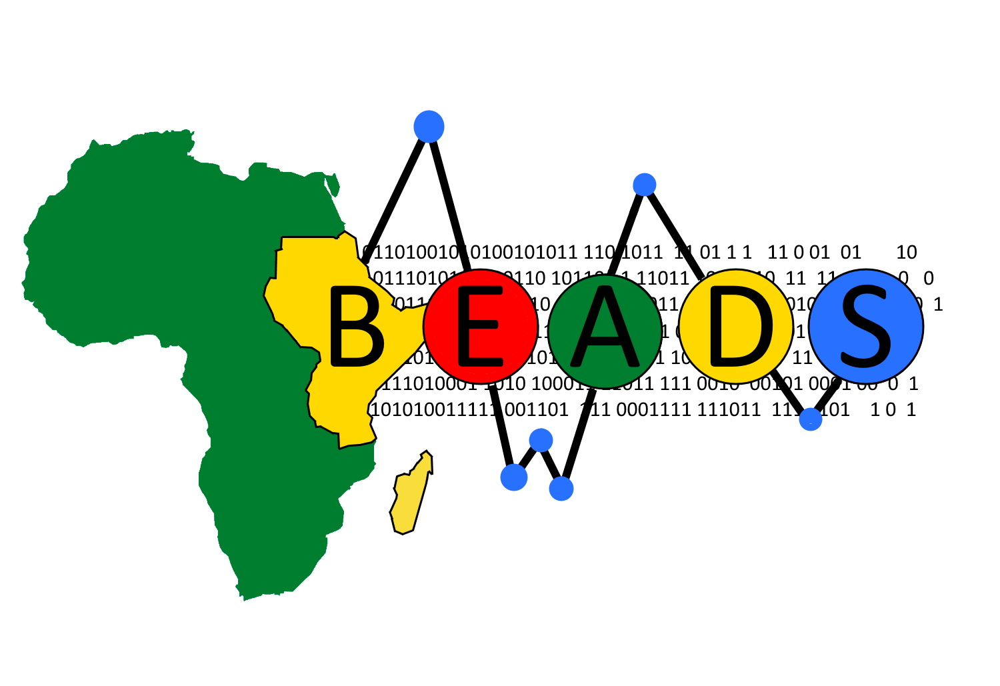

# BSBT 
----
## Bayesian Spatial Bradley--Terry
<!-- badges: start -->
[](https://www.tidyverse.org/lifecycle/#experimental)
[](https://travis-ci.com/rowlandseymour/BSBT)
[](https://github.com/rowlandseymour/BSBT/actions)
<!-- badges: end -->
----
📦 The `BSBT` R package allows you to fit a spatial Bradley--Terry model to comparative judgement data sets. The package estimates the quality of each area in the data set, based on the observed comparisons. The model requires a network to be constructed to represent how the areas are connected. It includes spatial information by placing a correlated prior distribution to the quality parameters, where the prior distribution parameters depend on  the network structure. The package estimates the model parameters using an MCMC algorithm. 

## Installation
----
You can install `BSBT` by calling the following commands:
```{r}
install.packages('devtools')
devtools::install_github("rowlandseymour/BSBT", dependencies = TRUE)
# devtools::install_github("rowlandseymour/BSBT") #for a quicker install
```

## Creating a Network from a Set of Areas
----
The first step is to create a network from the set of areas. Here's an example of a network made from Local Authority Areas in the England:

 There are two ways to do this in `BSBT`. The first is to construct an adjacency matrix, which describes which areas are neighbours. This can then be fed into `constrained_adjacent_covariance_function`. The second way is to use coordinates which can be used with`constrained_covariance_matrix`. This uses the Euclidean distance metric.


## Fitting the Model
----
The `BSBT` package uses MCMC the estimate the model parameters. The MCMC can be run by calling the `run_mcmc` function. This make take some time, up to a few hours, depending on how many areas there are in the model. Here are the results of the method applied to a comparative judgement data set in Tanzania:


## Data
----
In the package, there is a comparative judgement data set collected in Dar es Salaam, Tanzania. It includes over 75,000 comparisons, where citizens where are to compare subwards in the city based on deprivation. Also included are shapefiles for the 452 subwards. These can be accessed by calling `data(dar.comparisons, package = "BSBT")` and `data(dar.shapefiles, package = "BSBT")`.

There is also code for simulating comparative judgement data given the underlying levels of deprivation. More information can be found by calling `?BSBT::simulate_contests`

## Acknowledgements
----
This work is supported by the Engineering and Physical Sciences Research Council [grant number EP/T003928/1] and the Big East African Data Science research group at the University of Nottingham.

The comparative judgement dataset was collected by Madeleine Ellis, James Goulding, Bertrand Perrat, Gavin Smith and Gregor Engelmann. We gratefully acknowledge the Rights Lab at the University of Nottingham for supporting funding for the comprehensive ground truth survey. We also acknowledge Humanitarian Street Mapping Team (HOT) for providing a team of experts in data collection to facilitate the surveys. This fieldwork was also supported by the EPSRC Horizon Centre for Doctoral Training - My Life in Data (EP/L015463/1) and by EPSRC grant Neodemographics (EP/L021080/1).


 


